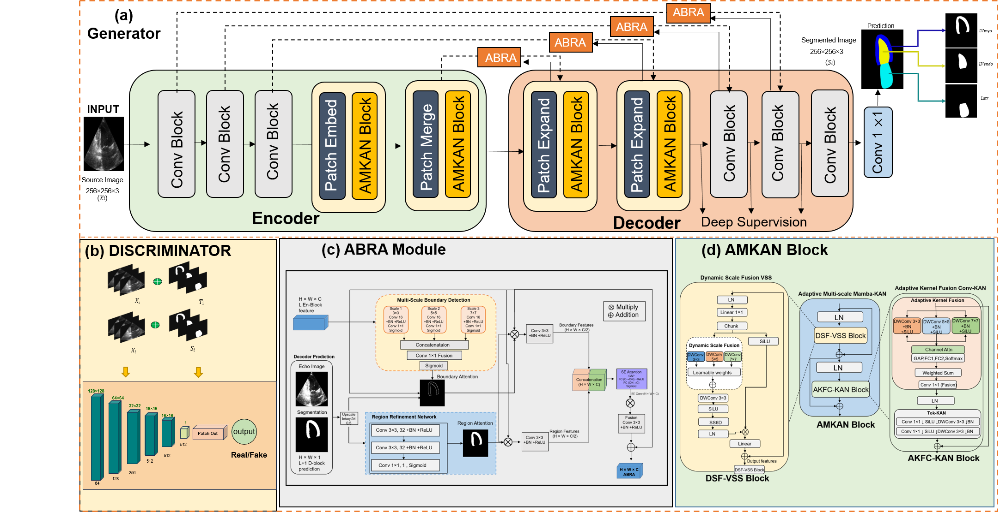

# MK-GAN

Implementation of MK-GAN for echocardiographic segmentation.

## Architecture



## Repository Structure

```
MK-GAN/
├── MKGAN.py          # Model architecture
├── losses.py         # Loss functions
├── dataloader.py     # Data loading
├── train.py          # Training script
├── test.py           # Evaluation script
├── requirements.txt  # Dependencies
└── assets/
    └── model.png     # Architecture diagram
```

## Installation

```bash
git clone https://github.com/yourusername/MK-GAN.git
cd MK-GAN
pip install -r requirements.txt
```

## Usage

### Training

```bash
python train.py \
    --train_image_dir /path/to/train/images \
    --train_mask_dir /path/to/train/masks \
    --val_image_dir /path/to/val/images \
    --val_mask_dir /path/to/val/masks \
    --epochs 300 \
    --batch_size 1 \
    --lr 2e-4
```

### Evaluation

```bash
python test.py \
    --test_image_dir /path/to/test/images \
    --test_mask_dir /path/to/test/masks \
    --checkpoint checkpoints/mkgan_best.pth \
    --save_dir results
```

## Requirements

- Python 3.8+
- PyTorch 2.0+
- CUDA 11.3+ (recommended)

## Datasets

- CAMUS
- EchoNet-Dynamic
- HMC-QU
- MCE

## Citation

```bibtex
@article{mkgan2025,
  title={MK-GAN},
  author={Author Name},
  year={2025}
}
```

## License

MIT
